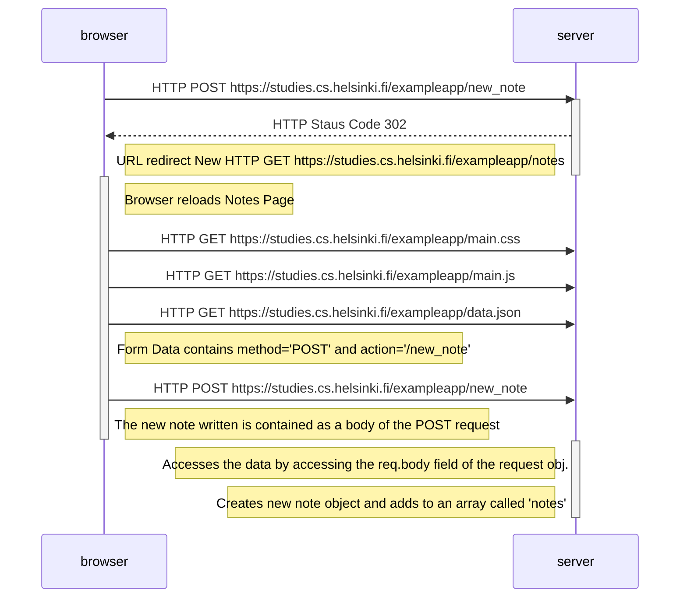

```mermaid
sequenceDiagram

participant browser
participant server

browser->>server: HTTP POST https://studies.cs.helsinki.fi/exampleapp/new_note
activate server
server-->>browser: HTTP Staus Code 302
Note left of server: URL redirect New HTTP GET https://studies.cs.helsinki.fi/exampleapp/notes
deactivate server

activate browser
Note right of browser: Browser reloads Notes Page

browser->>server: HTTP GET https://studies.cs.helsinki.fi/exampleapp/main.css
browser->>server: HTTP GET https://studies.cs.helsinki.fi/exampleapp/main.js
browser->>server: HTTP GET https://studies.cs.helsinki.fi/exampleapp/data.json
Note right of browser: Form Data contains method='POST' and action='/new_note'
browser->>server: HTTP POST https://studies.cs.helsinki.fi/exampleapp/new_note
Note right of browser: The new note written is contained as a body of the POST request
deactivate browser

activate server
Note left of server: Accesses the data by accessing the req.body field of the request obj.
Note left of server: Creates new note object and adds to an array called 'notes'
deactivate server
```

```

```
