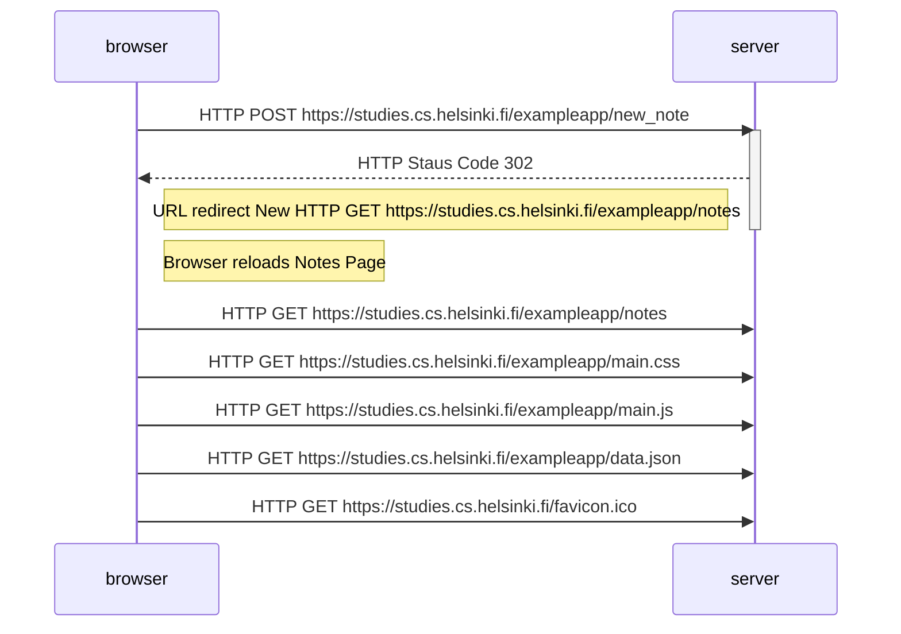

```mermaid
sequenceDiagram

participant browser
participant server

browser->>server: HTTP POST https://studies.cs.helsinki.fi/exampleapp/new_note
activate server
server-->>browser: HTTP Staus Code 302
Note left of server: URL redirect New HTTP GET https://studies.cs.helsinki.fi/exampleapp/notes
deactivate server

Note right of browser: Browser reloads Notes Page

browser->>server: HTTP GET https://studies.cs.helsinki.fi/exampleapp/notes
browser->>server: HTTP GET https://studies.cs.helsinki.fi/exampleapp/main.css
browser->>server: HTTP GET https://studies.cs.helsinki.fi/exampleapp/main.js
browser->>server: HTTP GET https://studies.cs.helsinki.fi/exampleapp/data.json
browser->>server: HTTP GET https://studies.cs.helsinki.fi/favicon.ico
```

```

```
