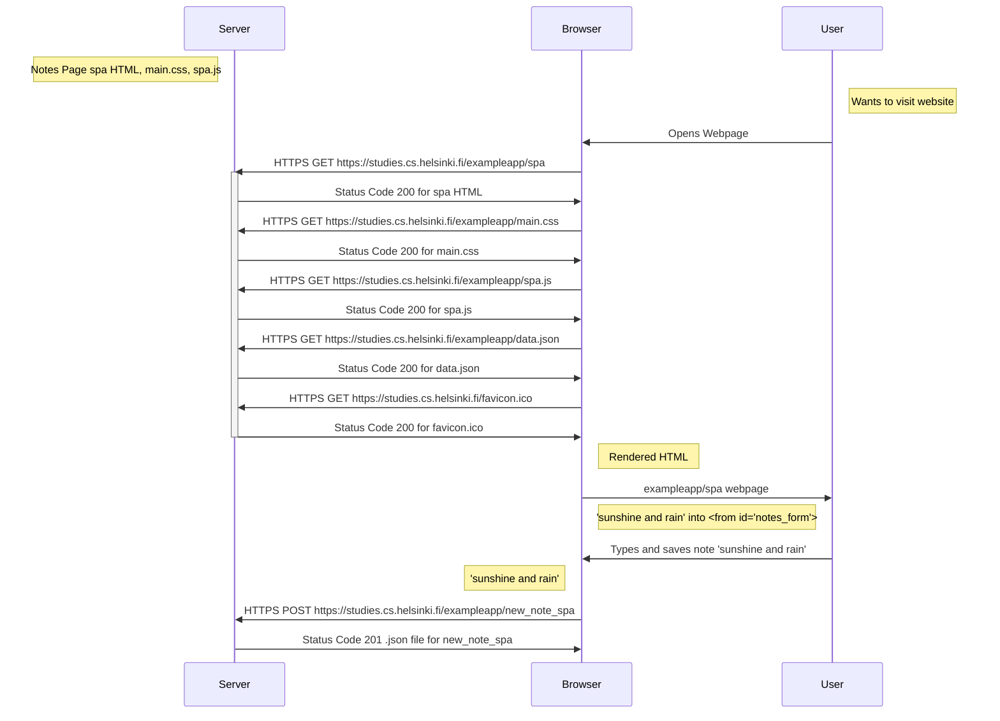

```mermaid
sequenceDiagram
	participant Server
	participant Browser
	participant User

	Note left of Server : Notes Page spa HTML, main.css, spa.js
	Note right of User : Wants to visit website

	User ->> Browser : Opens Webpage
	Browser ->> Server : HTTPS GET https://studies.cs.helsinki.fi/exampleapp/spa
	activate Server
	Server ->> Browser : Status Code 200 for spa HTML
	Browser ->> Server : HTTPS GET https://studies.cs.helsinki.fi/exampleapp/main.css
	Server ->> Browser : Status Code 200 for main.css
	Browser ->> Server : HTTPS GET https://studies.cs.helsinki.fi/exampleapp/spa.js
	Server ->> Browser : Status Code 200 for spa.js
	Browser ->> Server : HTTPS GET https://studies.cs.helsinki.fi/exampleapp/data.json
	Server ->> Browser : Status Code 200 for data.json
	Browser ->> Server : HTTPS GET https://studies.cs.helsinki.fi/favicon.ico
	Server ->> Browser : Status Code 200 for favicon.ico
	deactivate Server

	Note right of Browser : Rendered HTML

	Browser ->> User : exampleapp/spa webpage
	Note left of User :'sunshine and rain' into <from id='notes_form'>
	User ->> Browser : Types and saves note 'sunshine and rain'
	Note left of Browser : 'sunshine and rain'
	Browser ->> Server : HTTPS POST https://studies.cs.helsinki.fi/exampleapp/new_note_spa
	Server ->> Browser : Status Code 201 .json file for new_note_spa


```
